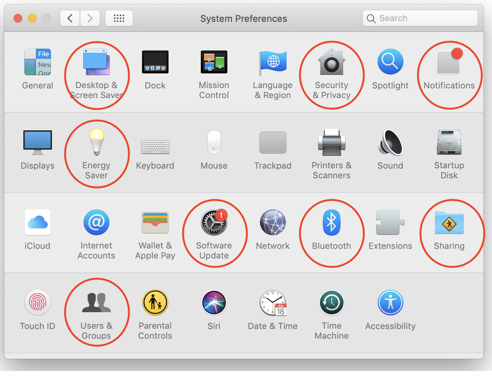
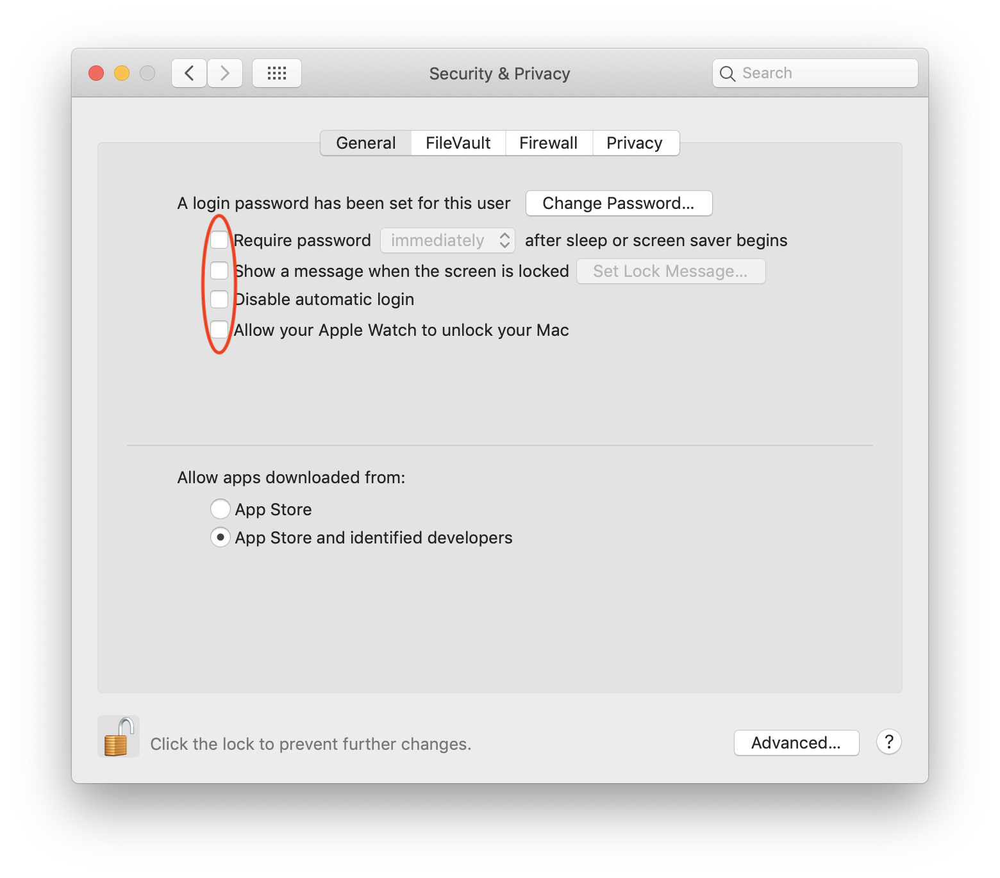
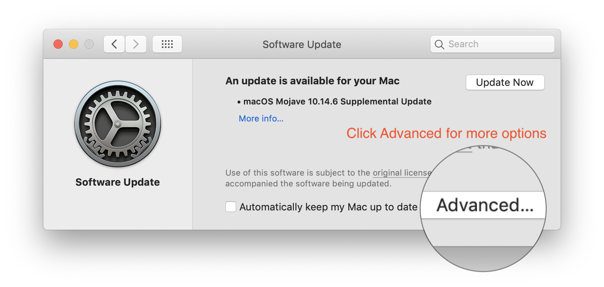
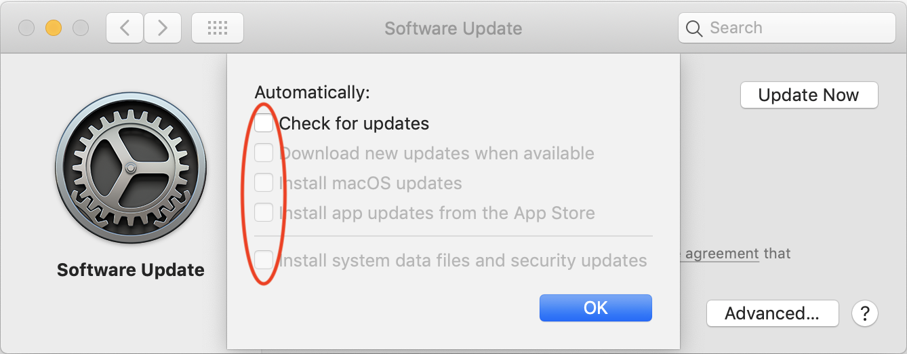
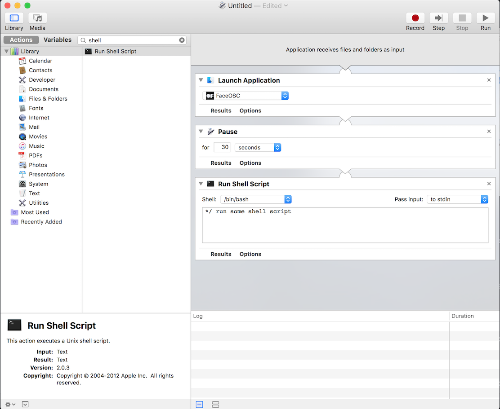
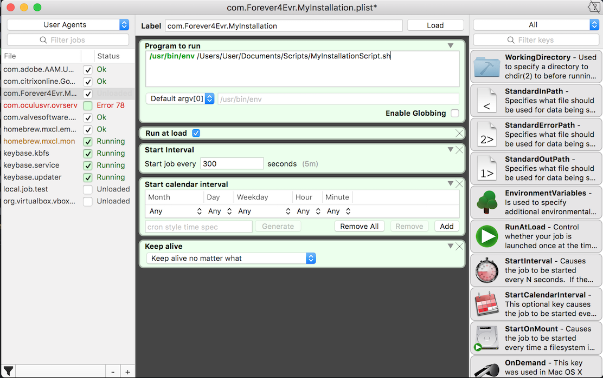
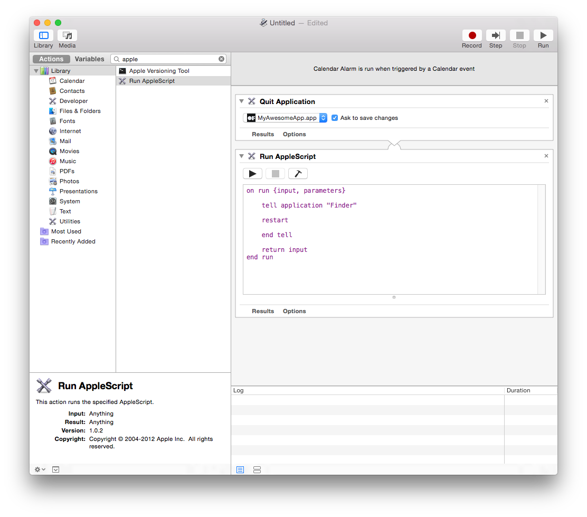
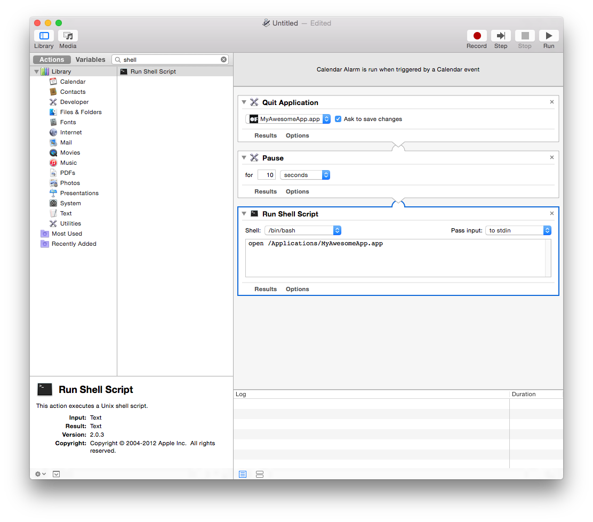

---------

Posted to Git for other people's modifications - please contribute if you'd like!

[Windows Version from Branger Briz](https://github.com/brangerbriz/up-4evr-windows-10)

[Ubuntu Linux Version from Branger Briz](https://github.com/brangerbriz/up-4evr-ubuntu)

Changelog:
August 2019 - modified article to remove old tips that are less helpful. Added a quick checklist

---------

## Table of Contents


1. [TL;DR Quick Checklist](#TL;DR-Quick-Checklist)
2. [Step 1: Prep your software and the computer](#prep-your-software-and-the-computer)
    1. [Desktop and Screensaver](#desktop-and-screensaver)
    1. [Energy Saver](#energy-saver)
    1. [Security](#security)
    1. [Users and Groups](#users-and-groups)
    1. [Software update](#software-update)
    1. [Sharing](#sharing)
    1. [Network](#network)
    1. [Bluetooth](#bluetooth)
    1. [Notification Center](#notification-center)
    2. [System Integrity Protection](#system-integirty-protection)
1. [Step 2: Boot into your software](#boot-into-your-software)
1. [Step 3: Keep it up (champ!)](#keep-it-up-champ)
    1. [Launchd](#launchd)
    1. [Lingon](#lingon)
    1. [LaunchControl](#launchcontrol)
    1. [Shell Script+Cron Job Method](#shell-script)
    1. [Non-Cronjob - Shell Script Method](#non)
1. [Step 4: Reboot periodically](#reboot-periodically)
1. [Step 5: Check in on it from afar](#check-in-on-it-from-afar)
1. [Step 6: Test, test, test](#test-test-test)
1. [Additional Tips: Logging](#additional-tips)
1. [Memory lead murderer](#memory-leak-murderer)
1. [Alternate Resources](#alternate-resources)
    1. [MAC OS X](#mac-os-x)
    1. [Linux](#linux)
    1. [Raspberry Pi](#raspberry-pi)
    1. [Windows](#windows)


## TL;DR Quick Checklist

- System Preferences:
	- **Recommended:**
		- [ ] Set Screensaver to Never (Screensaver)
		- [ ] Disable Automatic Software Updates (Software Update)
		- [ ] Set Computer and Display Sleep to Never (Energy Saver)
		- [ ] Set Desktop background to solid black (Desktop)
		- [ ] Uncheck "Disable Automatic Login" (Security)
		- [ ] Enable Automatic Login for a specific user (Users & Groups)
	- **Optional:**
		- [ ] Enable Screensharing and Filesharing (Sharing)
		- [ ] Disable Bluetooth Setup Assistant(Bluetooth)
		- [ ] Disable Notification Center/Set Do Not Disturb to be 24hrs (Notification Center)
	
- Booting into your software
	- [ ] placeholder
- Keeping the software running at all times\
	- [ ] placeholder
- Rebooting automatically
	- [ ] placeholder
- Remote access and logging
	- [ ] placeholder
- Testing
	- [ ] placeholder

## 2019 preface: 
This article was put together in 2012 as a personal guide for how to set up installation computers for professional creative technology installations, particularly for Mac computers. I needed something that put various tips in one space so that I could refer back to it when a new project came along. 

There was nothing like it at the time and it has become a cult reference guide for best practices for professionals and artists working with creative technology installations. The original version was very wordy and had some tips that end up being more distacting than useful, so I have gone through and stripped out sections and try to get to the point a bit more quickly.

## Intro:

When developing your project, at every stage, always think about the final installation and what things you'll need to do to keep it running forever. Getting a frantic call on a vacation day or weekend is never pleasant. I do not recommend relying on caretakers to know how to address bugs or get something running again. You will need to ensure the process to fix issues is extremely simple, especially if you're installing at a retail store or event that may not have technically savvy people there to help diagnose an issue.

This is a guide with tips on how to keep your MacOS-based installation running forever.

_As a security disclaimer. Many of these tips, like enabling automatic login, do weaken the intended security of Mac OS. Make sure to take extra precautions that your computer is not physically accessible by the public and that it is not easily accessed over the network by malicious actors._


## Prep System Preferences
-----------------------------------------------

This section covers the various MacOS settings you'll need to check and enable to keep them from interfering with your application running 24/7. You’ll need to go through and turn off or disable several different automatic settings to keep things from popping up over top of your application. Some of these screens have subtle changes depending on the OS version and whether you're on a desktop or laptop. Some settings have disappeared or been obscured since writing this in 2012 and may require a quick search to find if they are still accessible.

In System Preferences, you'll need to make some changes to each of these:



- ##### Screensaver
      Disable your screensaver. Set it’s time to **Never** 
      
- ##### Desktop
      I also suggest changing your desktop background to either black, a screenshot of your app, or your client's logo. Having the MacOS default backgrounds show up is a dead giveaway that something is wrong, and having the background be less loud can help fly under the radar. Another reason to do this is because of this simple fact: _it's not really broken until someone notices :)_
      
      If you're running multiple screens or computers, I've also found it helpful to make desktop backgrounds that have numbers, names or colors in them so you more easily tell them apart if you're mapping them together or something like that.

- ##### Energy Saver
    - Turn Display Sleep and Computer Sleep to **Never**. 
    - Enable “Start up automatically after power failure” and “Restart automatically if the computer freezes” (these are only available in 10.7 and later)
    - Restart automatically after computer power failure or kernel panic is enabled by default as of 10.8. You can view the current status of both of these settings in the terminal with the following command.
    ```bash
    sudo systemsetup -getrestartfreeze -getrestartpowerfailure
     ```
     
     ```systemsetup``` in the terminal is actually a great way to check and potentially script all of these settings. Maybe the next version of this article will put together a script that sets many of these with a simple command.
     
 

- ##### Security
    These tips in particular open up a range of vulnerabilities. Proceed with caution.
    
    I would make sure that **"Disable Automatic Login"** is unchecked so that your computer boots to the desktop instead of the password entry login screen. More about this in the following section.

    If necessary, for macOS 10.12 and beyond, you can re-enable and show the "Allow apps downloaded from Anywhere" option with this command:
    ```bash
      sudo spctl --master-disable
      ```
 

- ##### Users and Groups
    Go to Login Options (above the padlock) and enable "Automatic Login" for the user that will be running the installation.
    
    **IMPORTANT:** If you have any security concerns _at all_ do  not automatically login to an admin user. Create a new standard user and use this setting to login to that account. Using a standard user may make certain sudo commands more difficult though.

    

- ##### Software Update
    Disable automatic updates. Again, this could be a security risk down the line, but its helpful if future versions of MacOS break something in your app.
      

 
  


- ##### Sharing
    If you are running your main computer without a monitor or if it's in an inaccessible area, it can be a lifesaver to turn on File sharing and Screen sharing. This will allow you to access the computer and control it if you're on the same network (optional if you’re concerned about security). Screensharing is built into MacOS and you can access computers from a finder window with the Network sidebar item and click screenshare. 

 

 - ##### Network
    Your computer should almost always be hardwired to the network with ethernet - do not trust wifi :)
    
     However, If you dont need remote access or don’t need internet access for the installation, it’s not a bad idea to disable the Wifi completely. If Wifi is turned off, the “Please select a Wireless Network” window won't pop up when you least expect it. You can also turn off the option to ask you to join a new network if the proper one isn't found.

 - ##### Bluetooth
    If running without a mouse or keyboard plugged in, sometimes you can get the annoying  ”Bluetooth keyboard/mouse setup” pop up over your application. You can temporality disable these by going to the advanced settings within the Bluetooth Preferences. See below for it’s location after clicking Advanced on the Bluetooth setting.

 


 - ##### Notification Center and Popups
 
You can either [disable Notification Center completely](http://www.tekrevue.com/tip/how-to-completely-disable-notification-center-in-mac-os-x/) (requires disabling SIP) , or set your "Do Not Disturb" to basically on be on forever by setting it with overlapping times like the screenshot below


You can also disable the "This Application Unexpectedly Quit" and the subsequent bug report that comes with it by running this command in terminal OR renaming the Problem Reporter app:

_(Requires disabling SIP)_

```bash
sudo chmod 000 /System/Library/CoreServices/Problem\ Reporter.app
```
 - ##### System Integrity Protection  (SIP)
**Note:** As of macOS 10.11 some system settings can only be altered by turning off Apple's System Integrity Protection (SIP) setting. It is recommended that you leave SIP enabled unless you absolutely need to disable it. For example, if you would like to completely disable the Notification Center by unloading the launch agent you must disable SIP.

As Apple describes it : "System Integrity Protection is a security technology in OS X El Capitan and later that's designed to help prevent potentially malicious software from modifying protected files and folders on your Mac. System Integrity protection restricts the root user account and limits the actions that the root user can perform on protected parts of the Mac operating system"

SIP will not allow you (even if you are an admin) to modify files or settings located in
* /System
* /usr
* /bin
* /sbin
* Apps that are pre-installed with OS X

To disable SIP
1. Restart your Mac.
1. Before OS X starts up, hold down Command-R and keep it held down until you see an Apple icon and a progress bar. Release. This boots you into Recovery.
1. From the Utilities menu, select Terminal.
1. At the prompt type exactly the following and then press Return:
```bash
csrutil disable
```
1. Terminal should display a message that SIP was disabled.
From the  menu, select Restart.


Another useful tool for modifying certain OSX .plists for disable or enabling certain things is [Tinkertool](http://www.bresink.com/osx/TinkerTool.html) You can use this to disable or enable certain things that System Preferences doesn't cover.

I would also look at this filepath and you can rename files in here to temporarily disable them on the computer you're using: /System/Library/CoreServices (requires disabling SIP)

You can rename "Notification Center" to "Notification Center_DEACTIVATE" or something (or you can move it) - and then you won't get any obnoxiously "helpful" Notification Center popups. (requires disabling SIP)

After OSX 10.9 - Apple enabled this strange feature called App Nap that detects when an App isn't doing much and makes it use even less resources - could be problematic - [check this page out for how to disable for now](http://www.tekrevue.com/tip/disable-app-nap-os-x-mavericks/)

If necessary, You can also hide all of the desktop icons with this terminal command:

```bash
defaults write com.apple.finder CreateDesktop -bool false;
killall Finder
```
To re-enable the desktop run the same command but set the bool to 'true'


## Boot into your software
-------------------------------

Things get unplugged, power goes out, not everyone has budget or space for a battery backup etc etc. Above, I covered how to have everything reboot automatically after power failures or freezes, but you’ll also need your app to be ready to go from boot and not leave the desktop open to prying eyes. There are many ways to have your application load automatically - the simplest is using OSX's built in tools: In the System Preferences “Accounts” panel, select “Login Items” and drag your application into there to have it open automatically on launch.


Sometimes you may need to have several processes start in order for your installation to run properly. My favorite tool when it comes to starting up complicated installations is Apples built in [Automator](https://developer.apple.com/library/content/documentation/AppleApplications/Conceptual/AutomatorConcepts/Articles/AutomatorOverview.html#//apple_ref/doc/uid/TP40001508-BCIJAFHH).

Using Automator you can easily create complicated startup sequences that include delays and shell scripts as needed.



After you've created and tested your automator script you can save it as an application and add it to your startup items list.

## Keep it running forever
---------------------------

#### Prepare your software first!

Plan which things will need to be adjusted and accessed by you or a caretaker throughout your project's lifespan. Debug menus, hidden sliders, key commands and config files are great when you can't compile the app anymore. The time you spend now to make things simple will save you hours of remote debugging when something breaks.


There are several ways to make sure your application goes up and stays up -

#### Launchd

Using Launch Daemons is an alternate way to get apps to load on boot and to continuously re-open them if they go down. Launchd plists are very useful alternatives to cron jobs and can be used to run things on a periodic basis or on calendar days. You could achieve similar results with a combination of automator and iCal, but it depends on what you’re comfortable with.

Here is an [Apple Doc](http://developer.apple.com/library/mac/#documentation/MacOSX/Conceptual/BPSystemStartup/Chapters/CreatingLaunchdJobs.html) on using Launch Agents and Launch Daemons in various ways.

The [difference between a Launch Daemon and a Launch Agent](http://techjournal.318.com/general-technology/launchdaemons-vs-launchagents/) (Basically whether you need it to run when a user is logged in or not…for most simple options like launching a regular app, you’ll just want a Launch Agent)

Also note (!) that you may need to point your launch daemon to a file within your .app package, not just the app itself - you have to point it to the file in the MacOS folder inside the .app package (right-click your app and select "Show package Contents") Otherwise you might be wondering why the launchdaemon isn't launching your app.

A launchd example from [admsyn](https://gist.github.com/4140204)

Of course you could make the launchd plist yourself for free from a template like above. You can read all about them with the command "man launchd.plist" typed into terminal to get an idea of what each toggle controls. One quick method to setting up Launchd is to use [LaunchControl](http://www.soma-zone.com/LaunchControl/). LaunchControl is available for $10 however its developers do not enforce copyright protection. If you do use their software please be nice and purchase a license. For non-profit and educational institutios soma-zone allows free use. Another alternative is Lingon ($4.99 in the App Store) or [Lingon X](http://www.peterborgapps.com/lingon/)

#### Lingon
<br>
In Lingon, hit the + to create a new launchd plist. Just make it a standard launch agent. Now Set up your plist like so:


One additional/optional thing you can add to this is to put an additional key in the plist for a “Successful Exit”. By adding this, your app won’t re-open when it has detected that it closed normally (ie You just hit escape intentionally, it didn’t crash). Can be useful if you’re trying to check something and OS X won’t stop re-opening the app on you. To easily add this to the key, click the advanced tab and click the checkbox for "Successful exit" - or just add it manually as it in the above screenshot.

#### LaunchControl
<br>
In LaunchControl press Command + N to create a new User Agent. You can rename the new agent to whatever you like. the default name is "local.job". You can then setup your agent using the GUI items on the right side of the application by dragging and dropping them in place. There are several powerful options for scheduling and setting up conditional tasks. Checkout soma-zones [FAQ](http://www.soma-zone.com/LaunchControl/a/FAQ.html) if you run into any problems. You can also checkout this primer on Launch Daemons at http://www.launchd.info



#### Shell script+Cron Job method

(I got the following super helpful tip from [Kyle McDonald](http://kylemcdonald.net/))
)

This method is sort of deprecated in relation to the launchd method - you can run shell scripts with Lingon and launchd in the same manner as what we've got here. Shell scripting is your best friend. With the help of the script below and an application called CronniX (or use Lingon) , you will be able to use a cronjob to check the system’s list of currently running processes. If your app does not appear on the list, then the script will open it again, otherwise it won’t do anything. Either download the script or type the following into a text editor, replacing Twitter.app with your app’s name and filepath. Don’t forget the “.app” extension in the if statement!:

	\#!/bin/sh
		if [ $(ps ax | grep -v grep | grep "Twitter.app" | wc -l) -eq 0 ]
		then
		echo "Twitter not running. opening..."
		open /Applications/Twitter.app
		else
		echo "Twitter running" 
		fi

Save that file as something like “KeepOpen.sh” and keep it next to your application or somewhere convenient.

After creating that file, you’ll need to make it executable. To do this, open the Terminal and in a new window type “chmod +x ” and then enter the path to the shell script you just created (you can either drag the shell script into the terminal window or manually type it). It would look something like this:


    4Evr-MacBook-Pro:~ Forever4Evr$ chmod +x /Users/Forever4Evr/Desktop/KeepOpen.sh

After you have made it executable, you’re now ready to set it up as a cronjob. Tip: to test the script, you can change the extension at the end to KeepOpen.command as an alternative to opening it with Terminal, but the same thing gets done.

Cronjobs are just low level system tasks that are set to run on a timer. The syntax for cronjobs is outside of the scope of this walkthrough, but there are many sites available for that. Instead, the application CronniX can do a lot of the heavy lifting for you.

After downloading CronniX, open it up and create a new cronjob. In the window that opens,  in the command window, point it to your KeepOpen.sh file and  check all of the boxes in the simple tab for minute, hour, month, etc. This tells the job to run every minute, every hour, every day, every month. If you want it to run less frequently or at a different frequency, play around with the sliders.


Now just hit “New” and then make sure to hit “Save” to save it into the system’s crontab. Now if you just wait a minute then it should open your app every minute on the minute. Maybe save this one for the very end if you have more to do :)

This is a great tool if there is an unintended crash because the app will never be down longer than a minute.

#### Non-Cronjob - Shell Script Method

    \#!/bin/bash

    while true
    do
    #using open to get focus
    echo "Trying to open empty example"
    open -a emptyExample
    sleep 10
    done

Just type this into a plaintext document and save it as something like ”KeepMyAppAlivePlz.command” and then use chmod as above to make the file executable  and then drop this in your login items as  above. This one will just continuously try and open your app every 10ms, but if it is already open, the OS knows to not try opening it a second, third, fourth time.

Make sure to check the Console.app for any errors that may have come through when no one caught them, whenever you check the installation in person or remotely. This is not a fix-all for buggy programming, just a helper to keep things running smooth. The more things you can do to leave yourself notes about why the crash happened, the faster you can address the core issue.

Applescript is also a very solid choice for doing some more OS specific work in terms of having odd menus clicked or keypresses sent in some order.

## Reboot periodically
---------------------------

This one is a little more preventative, or maybe superstitious so hopefully someone can point out a concrete reason why this is a good idea. Depending on your app and the amount of stuff it reaches into, there could be some memory leaks or other OS bugs that you haven’t accounted for. Rebooting every day or week is a good idea to keep everything tidy, system wise.

The simplest option by far would be to go to System Preferences->Energy Saver and then click “Schedule…” and enter in some values if you need to turn the computer off to rest for a longer period of time to save it some stress when it might not be used at night time or something. Heat can do funny things sometimes, so if you have a chance to get your computer to rest and the time to test it, definitely give this a shot…saves some energy too which is nice.


You could also set up another shell script with a crontab as above with CronniX or setup a User Agent with LaunchControl that closes applications and reboots the system as often as you specify.

Another option (if you don’t want to deal with the terminal and shell scripting) is to use iCal to call an Automator iCal event. This method is perhaps a little easier to schedule and visualize when you will reboot. Within Automator, create a new file with the iCal event template to do something like this:



Run it to see if it does what you expect and then save it out. When you save,it will open in iCal as an action that gets opened. Just set it to repeat as often as you’d like. You can also set things like having it email you when it reboots or runs the script.

If you’d like to just close your programs and re-open them and there is a background and foreground do something like this (pauses are so the quitting and re-opening stuff has time to actually execute):



## Check in on it from afar
---------------------------------

There are a bunch of options here from various paid web services (like [Logmein](http://www.logmein.com/) or [Teamviewer](http://teamviewer.com/)), to VNC (many options for this: [RealVNC](http://realvnc.com/) and Chicken of the VNC tend to come up a bunch) to [SSHing](http://www.mactricksandtips.com/2009/06/ssh-into-your-mac.html). The choice here depends on your comfort level and how much you need to do to perform maintenance from far away. Also - see below for tips on logging the status of your app as an alternative way

Leaving a Dropbox connected to the computer and your own is super useful for file swaps between the two computers. Although most remote screensharing services have file sharing built in, Dropbox is just a nice, fairly transparent option.

Determining the IP of the machine on a dynamically allocated network can be a pain, especially in screenless/headless installations. To make this a little easier, Robb Godshaw wrote a little Automator Script that says the IP aloud using Text-to-Speech 30 seconds after the computer boots. [Download link on Instructables.](http://www.instructables.com/id/Configuring-a-Mac-for-an-always-on-operation/steps/9)

## Test test test
-------------------------


You’ve already tested and perfected your software for the installation, so make sure to test all of the above methods and automatic scripts in as realistic manner as you can before you leave it alone for the first day at school.

You can’t account for everything, so don’t beat yourself up if something does eventually happen, but this list will hopefully alleviate a little bit of frustration. Good luck!


## Additional Tips + Logging
------------------------

If you have an installation that runs for weeks or months, you might want a way to keep tabs on it that doesn’t involve remotely logging in and checking on it. A good thing to have would be to have something on the system that writes certain info to a text file (kept on a linked Dropbox), or better write that file to a web server that you can then check.

There are a couple things you can do depending on what you want to know about the state of your installation.

There is a terminal command you can use to get a list of all of the currently running processes on your computer:

    ps aux (or ps ax)

(more info above ps commands [here](https://developer.apple.com/library/mac/documentation/Darwin/Reference/ManPages/man1/ps.1.html))) – Further more you can filter this list to only return applications you’re interested in learning about:

    ps aux | grep "TweetDeck"

This will return a line like this:

    USER             PID  %CPU %MEM      VSZ    RSS   TT  STAT STARTED      TIME COMMAND
    laser          71564   0.4  1.7  4010724 140544   ??  S    Sun03PM  14:23.76 /Applications/TweetDeck.app/Contents/MacOS/TweetDeck -psn_0_100544477
    laser          95882   0.0  0.0  2432768    600 s000  S+   12:11PM   0:00.00 grep TweetDeck

Now you have the following useful info: CPU usage, Memory usage (as percentage of total memory), Status, Time Started, Time Up

All that is left is to write this output to a text file, which you can do with a line like this:

    ps aux | grep 'TweetDeck' >> /Users/laser/Dropbox/InstallationLogs/BigImportantInstall/Number6ProcessLog.txt

This line basically says - tell me the open processes (px aux) - only give me the lines that have "Tweetdeck" in them (grep Tweetdeck) - and then append them to a text file located at this location ( >> path_to_text_file)

Now we just need to make this an executable shell script and set it up as a launch daemon or cron job – see above at Step 3 to learn how to run the shell script at a regular interval using Lingon and launchd. If the app isn’t running, it will only return the “grep YourAppName” process which is a good thing to log because if your app isn’t open you won’t know how long it’s been out (nothing will be logged), but having the grep process logged will at least tell you it was checking for it. Grep will also more accurately tell you what time it checked – the other app will only give you a start time and up time.

Let’s also take this one step further and say, hypothetically, that the Triplehead2Go display adapter you have is fairly wonky and you don’t always get the displays or projectors to connect after reboot – or maybe a projector is shutting itself off and disrupting things. Well we can log the currently available resolutions too! Try entering the line below in your own terminal:

    system_profiler SPDisplaysDataType

This will return a list of connected displays and some metadata about them including resolution and names.

Let’s say you want to make sure you’re running a resolution of 3840×720 at all times…or you want a log of resolution changes. You would do something like:

    system_profiler SPDisplaysDataType | grep Resolution

This will return “Resolution: 3840×720″ which you can combine with the above lines to write it all to a text file. So here would be your shell script file if you wanted to record the currently running processes and the current resolutions:

        #!/bin/bash
    ps aux | grep 'YourAppName' >> /Users/you/filepath/Install6ProcessLog.txt
    system_profiler SPDisplaysDataType | grep Resolution >> /Users/you/Dropbox/Install6ProcessLog.txt

And now you’re feeling excited, maybe you want to grab a fullscreen screenshot at a regular interval too, just to make sure there is no funkiness happening that you can’t see…well you could add this line to the above as well:

    screencapture ~/Desktop/$(date +%Y%m%d-%H%M%S).png

This will save a screenshot to the desktop (specify your own file path) with a formatted date and time. You may want to do this every hour instead of every 5 minutes since it’s a big chunk of data and it may cause some issue with your screens. As usual – test before deploying!

Bonus points would be to create an auto-generated table and webpage that takes all of this info and puts it into a nice view that you can use to check all of your installations at a glance.

If the process logger isn’t enough, we can use what we learned in that process to actually set up a system to email you if something is amiss so you don’t have to manually check it. We can do this all with the command line and internal tools, it’s just a more involved setup. This is going to be fairly general and will need some tuning in your specific case.

First you will need to configure postfix so you can easily send emails from the terminal – [follow the instructions here as closely as possible](http://benjaminrojas.net/configuring-postfix-to-send-mail-from-mac-os-x-mountain-lion/)

If you were using a gmail account you would do:

*InstallationSupport@gmail.com*

*pass: yourpassword*

The line in the passwd file mentioned in the article would be: smtp.gmail.com:587 installationSupport@gmail.com:yourpassword

Now send a test email to yourself by running: echo “Hello” | mail -s “test” “InstallationSupport@gmail.com”

Second step is to combine this new found ability to send emails from the Terminal with a process to check if your application is still running…something like the below would work with some tweaking for what you’re looking to do:

    #!/bin/sh
    if [ $(ps ax | grep -v grep | grep "YourApp.app" | wc -l) -eq 0 ] ; #Replace YourApp.app with your own app's name     
    then
            SUBJECT="Shit broke"
            EMAIL="InstallationSupport" #this is the receiver
         EMAILMESSAGE="This could be for adding an attachment/logfile"
         echo "The program isn't open - trying to re-open">$SUBJECT
         date | mail -s "$SUBJECT" "$EMAIL"  "$EMAILMESSAGE"

            echo "YourApp not running. Opening..."

        open /Applications/YourApp.app #reopen the app - set this to an exact filepath
    else
        echo "YourApp is running"
    fi

Now you just need to follow the instructions from Step 3 above to set this shell script up to run with launchd – you can check it every 5 minutes and have it email you if it crashed. You could also adapt the If statement to email you if the resolution isn’t right or some other process condition.

### Appendix and uncategorized and out of date tips
-------
####Deploying an image to multiple computers and backing up:
If you’re setting up multiple computers, you can do these prep steps on one of them and just boot the others into target disk mode and use something like [Carbon Copy Cloner](http://www.bombich.com/) to mirror the first one on the next so everything is as consistent as possible. I've noticed a few things don't always transfer like sleep and screensaver settings, so make sure to double check those are sticking.

For Windows and Linux, I highly recommend the use of [Clonezilla](https://clonezilla.org) - on its surface it looks junky, but it is actually incredibly well made and robust if you can deal with the command line interface. I have used it on multiple WIndows and Linux projects and it's often worked like a charm. I first had to use it to clone a single disk image from one Windows 10 laptop to 150 identical laptops for an installation. I was able to set up an assembly line process with Clonezilla where I cloned one 15gb image to 150 computers in about 2 days with a thumbdrive. Clonezilla also offers the ability to work over a network connection if you are able to hardwire all of your computers and push an image out that way.

Clonezilla and Carbon Copy Cloner are also a great tools for creating a backup image of a computer. Once you have the image, you can have it stored in the cloud or a company server in the event the installation computer fails and you don't want to start this setup from scratch.

#### Memory leak murderer
In 2019 I don't recommend this as a best practice, but its more of a thought experiment about how to catch an app with a memory leak and reboot it if you didn't catch it during development.

See [this article](http://blairneal.com/blog/memory-leak-murderer/) about combining process with something that kills and restarts an app if it crosses a memory usage threshold

####Madmapper Applescript

[Note: Unsure if this still works in 2019.] If using MadMapper – see [this link](http://blairneal.com/blog/applescript-to-automatically-fullscreen-madmapper-for-installations/) for an AppleScript that will open MadMapper and have it enter fullscreen – and enter “OK” on a pesky dialog box.

## Alternate resources:
--------------------
The original outdated version of the article from 2012 is [here](http://blairneal.com/blog/installation-up-4evr/) 

### MAC OS X
This is an amazing addon for openFrameworks apps that keeps your application open even after a large range of failures: [ofxWatchdog](https://github.com/toolbits/ofxWatchdog
)
[http://vormplus.be/blog/article/configuring-mac-os-x-for-interactive-installations](http://vormplus.be/blog/article/configuring-mac-os-x-for-interactive-installations
) - it definitely has its quirks depending on your installation and it can really interfere with some of the other tips in this guide, but it has been a lifesaver for a few of my installations.

[Similar guide meant for live visuals/VJing](http://vjforums.info/wiki/setting-up-os-x-for-vjing/)

[Nick Hardeman's utility for setting all of these from one location](http://nickhardeman.com/610/openframeworks-configuring-osx-for-a-long-term-installation/)

Nick Hardeman's [ofxMacUtils from 2015](https://github.com/NickHardeman/ofxMacUtils) used for helping create a one stop shop for setting common system settings for installations

### LINUX

[Ubuntu Guide from Branger Briz](https://github.com/brangerbriz/up-4evr-ubuntu)

[ofBook guide](https://github.com/openframeworks/ofBook/blob/master/chapters/installation_up_4evr_linux/chapter.md)

### WINDOWS

[Windows Version from Branger Briz](https://github.com/brangerbriz/up-4evr-windows-10)

If you’re looking for help with this task with Windows, check out this awesome script [StayUp](http://www.bantherewind.com/stayup) from Stephen Schieberl. Also for Windows: http://www.softpedia.com/get/System/File-Management/Restart-on-Crash.shtml and this tool for scripting OS operations on windows http://www.nirsoft.net/utils/nircmd.html

Check out this great step by step from EVSC: http://www.evsc.net/home/prep-windows-machine-for-fulltime-exhibition-setup
